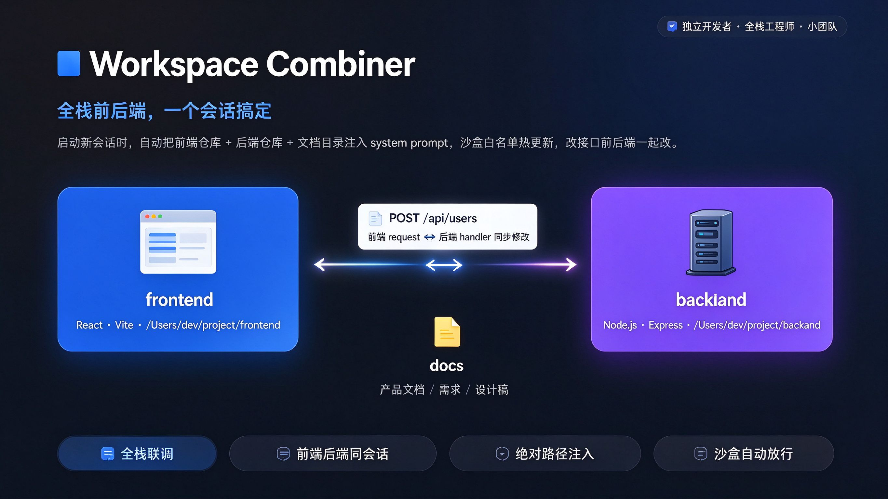

# dsh-workspace-combiner

  

  <em>为全栈开发者而生：把前端仓库、后端仓库与文档锚点捆进同一个 AI 会话。绝对路径注入、沙盒可写根自动同步，接口变更在同一轮对话里前后端一起改。</em>

  <strong>中文</strong> · <a href="./README.md">English</a>

---

一个用于 DSH（DeepSeek Harness）的 [Cordis](https://github.com/cordiverse/cordis) 双面插件，把一组仓库组织成协同的 **多工作区联合开发** 上下文。

插件在左侧边栏注册一个 **工作区组合器** 面板。每个「工作空间」绑定一个主目录（工作区锚点——放文档与非代码资产）加一组有序的 **代码项目** 目录（例如一个后端仓库、一个前端仓库）。新建会话时，插件把所有生效目录的绝对路径注入 system prompt，并把可写目录同步进 [@chaoset/sandbox-extra-roots](https://github.com/winliyou/dsh-plugins) 白名单。

为抑制注入上下文膨胀，插件提供 **五层上下文控制**：

1. **目录层** — 逐目录访问模式（`readwrite` / `readonly` / `disabled`）、主目录锚定、拖拽排序。
2. **配置层** — `anchor` / `single` 工作空间模式，以及可选的分组标签。
3. **加载层** — `full` / `summary` / `tree` 控制注入的文件细节量。
4. **命令层** — `@` 指令动态范围（`@dir/`、`@file`、`@功能名`）。
5. **索引层** — 功能/接口索引（端点 ↔ 服务端 ↔ 前端落点）+ token 预算按目录配额 + 低信号优先截断。

---

## 功能特性

- **工作空间** — 新建 / 重命名 / 删除 / 切换命名工作空间；每个工作空间拥有一个主目录与有序的代码项目目录，并带逐目录访问模式。
- **新建向导** — 填名称 + 基础路径，宿主创建同名主目录，并扫描识别 Java / Vue / React / Python / Go 等项目供多选。
- **三种添加目录方式** — 从 DSH 原生工作区选择、打开宿主目录选择器、或粘贴绝对路径。
- **目录三态访问** — `readwrite`（沙盒可写）、`readonly`（可见不可写）、`disabled`（不注入 prompt）。主目录恒为 `readwrite`。
- **工作空间模式** — `anchor`（主目录 = 文档锚点）与 `single`（主目录 = 核心业务代码）。
- **目录分组** — 可选分组标签（文档 / 后端 / 前端 / 参考 / 其他），在 prompt 中作为小标题渲染。
- **目录快照** — 保存 / 恢复 / 删除目录配置；恢复后立即重新同步沙盒白名单。
- **文件索引 + 加载模式** — 感知 `.gitignore` 的有界文件树扫描 + mtime 缓存；按工作空间选择加载模式控制注入细节。
- **功能/接口索引（新）** — 从代码里确定性抽取 HTTP 端点，并联结 **服务端注册处** 与 **前端调用处** 的 `文件:行号`；覆盖 TS/JS/TSX/JSX/Vue 与 Java/Kotlin/Go/Python/Ruby/C#。可在面板开关、调预算，并直接复制 `@功能名` 到会话里定位。
- **AI 功能摘要（可选）** — 开启后由模型为每个功能生成一句话摘要；按功能签名缓存并落盘，**后台异步生成**（不阻塞会话创建与首轮），任何失败静默降级。
- **上下文监控** — 面板卡片显示逐目录文件数、估算 token 与总预算：环形图总览 + 单行统计卡 + **横向可滚动条形图**，超过 80% / 100% 给出警告。
- **@ 指令动态范围** — prompt 分节教会模型把 `@` 前缀 token 解析为显式引用路径（`@dir/`、`@file`、`@"含空格的路径"`、`@功能名`），按需把文件纳入范围。
- **沙盒联动** — 读写目录被推入 `sandbox-extra-roots` 的 `extraWritableRoots`（优先热更新，回退为原子写 `~/.dsh/plugins/sandbox-extra-roots/config.json`）；底部图例显示实际进入白名单的目录数。
- **逐目录 Git 状态** — 每行显示分支，有未提交/未跟踪改动时以琥珀色 `*N` 标注，干净时为灰色，领先上游时 `↑N`；非仓库目录不显示。
- **目录备注** — 任意目录可挂一段随手备注，行内编辑，随目录配置一起持久化。
- **目录角色徽标** — 主目录标记 **Docs only**、其余标记 **Code**，一眼区分锚点与源码（悬停有说明）。
- **注入 prompt 实时预览** — 展开只读区块，渲染当前配置将注入的 **完整文本**，可一键复制。
- **固定高度面板 + 局部滚动** — 面板填满侧栏，只有列表滚动，标题与「新建会话」按钮不会滚出屏幕。
- **可拖拽分栏** — 在「项目目录」与「上下文预算」之间拖动分隔条（默认 6:4），比例会被记住。
- **键盘** — `Cmd/Ctrl+N` 新建会话、`Cmd/Ctrl+K` 命令面板、`Esc` 关闭；命令面板覆盖切换工作空间、添加目录、刷新统计与切换模式。

---

## 架构

~~~text
dsh-workspace-combiner/
├── package.json            # dsh 字段：bundle.patch + client.inject
├── cordis.patch.yml        # 注册补丁
├── tsconfig.json           # 类型检查
├── tsdown.config.ts        # 双入口构建：host + client
└── src/
    ├── invariant.ts        # 共享常量（插件 id / API 路径 / prompt 排序 / 默认预算）
    ├── prompt.ts           # 多工作区 prompt + 文件索引 + 功能索引渲染
    ├── store.ts            # 宿主持久化（~/.dsh/dsh-workspace-combiner.json）
    ├── sandbox-sync.ts     # sandbox-extra-roots 可写根同步
    ├── routes.ts           # /api/dsh-workspace-combiner 路由（仅 loopback）
    ├── core/
    │   ├── types.ts        # 共享类型（WorkspaceRef / Workspace / CodeIndexEntry / ...）
    │   ├── fileTree.ts     # 平台无关的文件树类型与纯工具（计数/渲染/token 估算）
    │   └── validate.ts     # 共享的目录项校验
    ├── host/
    │   ├── index.ts        # host 入口：prompt 分节 + session/created + 路由 + 缓存
    │   ├── projectDetector.ts # 扫描目录识别项目类型
    │   ├── fileIndex.ts    # 感知 gitignore 的有界文件树扫描 + 递归计数 + mtime/TTL 缓存
    │   ├── codeIndex.ts    # 功能/接口索引抽取 + 内存/磁盘缓存
    │   ├── codeIndexSummary.ts # 可选：AI 功能摘要（后台生成 + 落盘缓存）
    │   ├── gitStatus.ts    # 逐目录 分支 / 改动 / 未跟踪 / 领先
    │   └── contextStats.ts # token 估算 + 逐目录上下文统计
    └── client/
        ├── index.ts        # client 入口：侧栏图标 + 中心列面板
        ├── types.ts        # client 侧镜像类型
        ├── locales.ts      # 中英词典 + tt() 助手
        ├── api.ts          # client -> host fetch API
        └── panel/
            ├── WorkspaceCombinerPanel.tsx # 面板主体 + 图标
            ├── controller.ts              # 状态管理
            ├── NewWorkspaceWizard.tsx     # 新建工作空间向导
            ├── typeBadge.tsx              # 项目类型徽标
            ├── naming.ts                  # 名称清洗 / 查重
            └── styles.ts                  # 注入的 style 块（随主题适配）
~~~

### 数据流

~~~text
[客户端面板] --POST /api/.../...--> [宿主 store]
                                        │
                        session/created（顶层新建会话）
                                        ▼
        selectionBySession: sessionId -> { directories, mode, loadMode,
                                           tokenBudget, entries, codeEntries, codeIndexBudget }
                                        ▼
              systemPrompt.section(text 函数按会话渲染；同会话快照复用已渲染文本)
                                        ▼
   注入「多工作区联合开发模式生效」+ 目录清单 + 文件索引 + 功能/接口索引 + @规则
~~~

目录变化时宿主还会调用 `sandbox-extra-roots` 的
`sandboxExtraRootsConfig.set({ extraWritableRoots })` 做热更新；远程不可用时回退为原子写
`~/.dsh/plugins/sandbox-extra-roots/config.json`。

---

## 安装（本地目录）

> 前置：已安装 DSH，且依赖插件可用。

~~~bash
# 0) 依赖插件（必需）
dsh plugin --profile desktop add @chaoset/sandbox-extra-roots

# 1) 构建 lib/（host + client）
cd /path/to/dsh-workspace-combiner
pnpm install
pnpm build

# 2) 加载本插件
dsh plugin --profile desktop add file:./dsh-workspace-combiner

# 3) 校验
dsh plugin --profile desktop ls dsh-workspace-combiner

# 4) 重启 DSH Desktop（web profile 则重跑 dsh web）
~~~

改动源码后：`pnpm build`，然后把构建产物同步到 profile 的插件副本目录并重启
（或移除插件后重新添加）。

---

## 使用

  

1. 打开侧栏的 **工作区组合器** 标签。
2. 在工作空间列表里选一个，或用 **新建工作空间** 向导创建（名称 + 基础路径；宿主创建主目录并扫描代码项目）。
3. 添加目录（目录选择器或粘贴绝对路径）并核对每行：主目录标记 **Docs only**，其余 **Code**，附带 Git 分支、分组与访问模式。可拖拽排序；多选后可批量改访问模式、分组或删除。
4. 展开 **高级配置** 设置工作空间模式、文件加载模式、快照，以及 **@ 指令速查卡**。
5. 展开 **注入 prompt** 预览将发送的完整内容，必要时复制。
6. 点击 **新建会话** —— 在主目录打开、创建会话、把生效目录注入 system prompt 并同步沙盒可写根。
7. 看 **上下文预算** 卡：环形图、单行统计卡与 **横向条形图**；拖动上方分隔条可在它与目录列表之间分配空间。
8. 看 **功能/接口索引** 卡：核对端点与前后端落点；点条目复制 `@功能名`；用筛选框按功能/端点/路径过滤；右上可开关、调预算、切 AI 摘要。

> 注意：目录变更只对 **新建的会话** 生效；已打开的会话不会自动重载。

### 注入的 prompt（追加到 system prompt）

~~~text
# 多工作区联合开发模式生效
当前会话加载【2】个项目目录：
1.example-anchor【主项目 · 工作区锚点（文档/非代码文件保存区）】绝对路径：/abs/path
【后端】
2.example-backend【代码项目】绝对路径：/abs/path

# 文件索引（加载模式：summary）
【example-anchor】/abs/path
  12 文件 / 3 目录
【example-backend】/abs/path
  210 文件 / 42 目录

# 功能/接口索引（自动抽取，用于定位；以实际代码为准）
- @workspaceCreate → /api/dsh-workspace-combiner/workspace-create | 新建工作空间并切换为当前 | 服务端 src/routes.ts:130 | 前端 src/client/api.ts:39
- @state → /api/dsh-workspace-combiner/state | 服务端 src/routes.ts:116 | 前端 src/client/api.ts:34

# @指令 · 动态范围
- 消息中以 @ 开头的 token 是被显式引用的路径：@绝对路径，或 @相对某工作区根的相对路径。
- @结尾带 / 的是目录：需要其内容时列出其目录树（ls / read）。
- 其它是文件：需要其内容时先用 read 读取，禁止未读就声称已检查。
- 含空格的路径用 @"路径 with spaces" 包裹。
- @功能名（如 @workspaceCreate）：指上方「功能/接口索引」里的名字，展开即读取该项列出的服务端/前端文件，用于快速定位。

开发强制规则：
1. 读写文件、查看代码必须使用完整绝对路径，禁止相对路径
2. 多个仓库Git相互独立，提交互不干扰
3. 做接口变更时，同步修改后端代码与前端请求代码
4. 终端执行命令，必须填写文件完整绝对路径，不允许直接使用相对路径执行
~~~

---

## 配置

### 插件级（`cordis.patch.yml`，无 schema）

~~~yaml
workspace-combiner:
  enabled: true          # 总开关
  announceToAgent: true  # 是否注入多工作区 prompt 分节
~~~

### 工作空间级（面板内可改，随 dsh-workspace-combiner.json 持久化）

| 字段 | 默认 | 说明 |
| --- | --- | --- |
| model | `anchor` | 工作空间模式（anchor / single） |
| loadMode | `summary` | 文件加载模式（summary / tree / full） |
| tokenBudget | 60000 | 文件索引注入的 token 预算（实际生效） |
| codeIndexEnabled | true | 是否注入功能/接口索引 |
| codeIndexBudget | 400 | 功能索引的独立 token 预算 |
| codeIndexSummary | `off` | 摘要模式：off / llm（AI 生成一句话摘要） |

---

## 上下文与 token 优化

- **递归真实计数** — 摘要模式报告的是 **递归** 文件/目录总数（而非只数顶层），面板数字与实际体量一致。
- **按目录配额 + 余量回填** — 文件索引预算先保证每个目录都能出现，再把剩余预算补给被截断的目录，避免一个大目录把后面的代码项目整块挤掉。
- **低信号优先丢弃** — 预算不足时优先丢测试、夹具、快照、锁文件、sourcemap、声明文件与生成物，而不是按文件名顺序误伤源码。
- **预算真正生效** — 文件索引与功能索引各自受预算约束，超出时以块内标注说明。
- **同会话渲染缓存** — prompt 分节每个模型步都会求值一次；同会话快照直接复用已渲染文本，不再逐步重拼。
- **按需注入** — `@功能名` 规则仅在实际存在功能索引时注入；功能索引可整卡关闭。

---

## 性能与缓存

- **并行扫描** — 建会话时各目录并行扫描（保序）；文件树同级目录以有界并发（8）下钻，避免深/宽目录串行等待。
- **轻量探测** — 目录失效检测走 `/stat`（只 stat），不再为判断存在性构建整棵文件树。
- **缓存分层** — 文件树/计数缓存（根 mtime + 30s TTL）；功能索引缓存（目录签名 + 60s TTL + **落盘** `~/.dsh/dsh-workspace-combiner-code-index.json`）；AI 摘要缓存（签名 + **落盘** `~/.dsh/dsh-workspace-combiner-feature-summaries.json`，并发去重）。
- **深度统一** — `loadModeMaxDepth()` 是 summary/tree/full → 1/3/4 的唯一来源；`/file-index` 接收 `loadMode`，保证预览深度与真实注入一致（并复用同一份缓存）。
- **忽略目录收敛** — 默认忽略额外覆盖 `.pnpm-store`、`.next`、`.nuxt`、`.turbo`、`.venv`、`__pycache__`、`.gradle` 等。

---

## 设计约束

1. **会话 shell 只有一个不可改的 cwd。** 插件不改 cwd，而是靠 prompt 规则强制绝对路径。
2. **只对新建会话生效。** `session/created` 时快照勾选并绑定到该会话 id；旧会话与子/分支会话（带 `parentSession`）不注入。
3. **读模型** — DSH 沙盒的读本就不受限；三态访问只约束 **写**（经 `extraWritableRoots`）与 **是否进 prompt**。
4. **依赖** 声明在 `package.json` 的 `dsh.client.inject` 与 `peerDependencies`（`@chaoset/sandbox-extra-roots` 与 DSH host 服务）。
5. **功能索引是启发式的**（无 AST）：动态路由、别名导入、生成的客户端可能漏，同名常量可能误联；注入文本已注明「以实际代码为准」，超预算时按功能名截断。
6. **辅助路由**（仅 loopback）：`scan`、`stat`、`file-index`、`code-index`、`git-status`、`context-stats`、`workspace-patch`，以及 state / 工作空间 CRUD。

---

## 开发

~~~bash
pnpm install
pnpm typecheck     # tsc --noEmit
pnpm build         # tsdown -> lib/host/index.js + lib/client.js
pnpm watch         # 监视重建
~~~

- 宿主日志：同步失败等场景走 `ctx.logger.warn(...)`。
- 持久化：`~/.dsh/dsh-workspace-combiner.json`。
- 功能索引缓存：`~/.dsh/dsh-workspace-combiner-code-index.json`。
- 功能摘要缓存：`~/.dsh/dsh-workspace-combiner-feature-summaries.json`。
- 沙盒配置：`~/.dsh/plugins/sandbox-extra-roots/config.json`。

## 变更日志

见 [CHANGELOG.md](./CHANGELOG.md)。

## 许可

MIT
